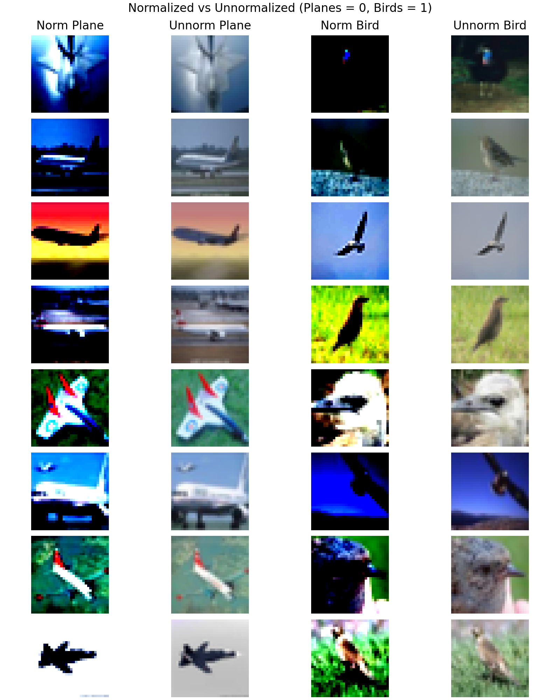
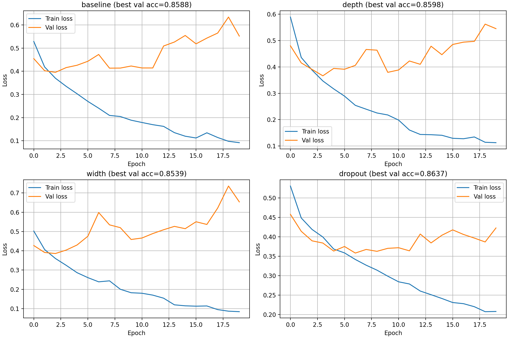
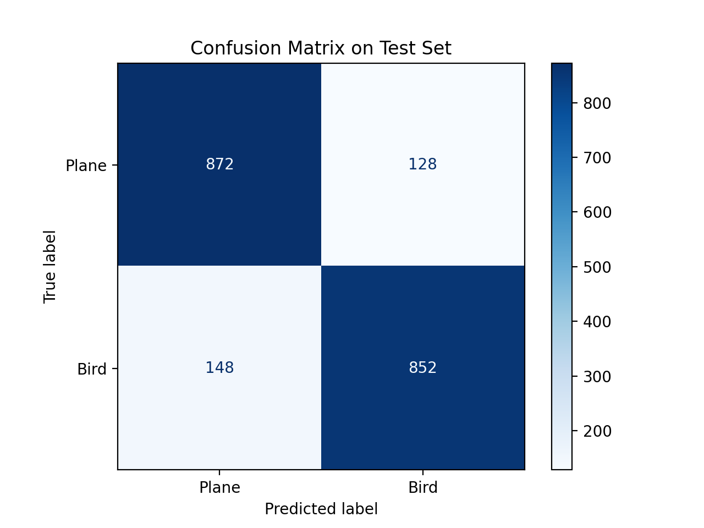
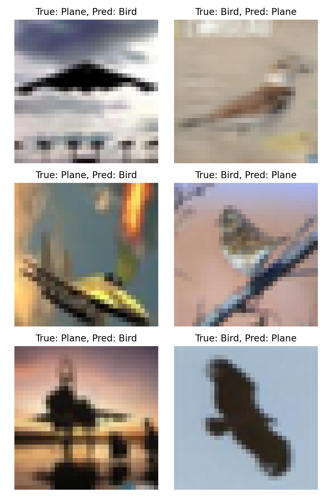

<h1 align="center">Report</h1> 
<h3 align="center">Project by Jakob Berg & Tobias Munch</h3> 


<h2 align="center">Backpropagation:</h2> 


### Overall approach:

The backpropagation function implements layer-wise backpropagation by iterating backwards through the network, from the output layer 𝐿 to the first hidden layer. This directly follows the theoretical formulation of backpropagation, where gradients are computed using the chain rule, propagating error signals from later layers to earlier ones.

The implementation closely matches equations (4), (5), (6), and (7).

The for loop iterates backwards through each layer in the model. This reflects the definition of backpropagation, becouse the gradient of each layer depends on the error signal propagated from the subsequent layer.


\[
\frac{\partial L}{\partial w^{[l]}_{i,j}}
= \delta^{[l]}_i \, a^{[l-1]}_j
\quad \forall l \in [1..L]
\] 

\[
\delta^{[l]}_i
= \frac{\partial L}{\partial z^{[l]}_i}
= \frac{\partial L}{\partial a^{[l]}_i}
\cdot
\frac{\partial a^{[l]}_i}{\partial z^{[l]}_i}
  (4)
\] 


\[
\delta^{[L]}_i
= \frac{\partial L}{\partial \hat{y}_i}
\cdot
\frac{\partial \hat{y}_i}{\partial z^{[L]}_i}
= e'_i(\hat{y}_i) \cdot f'^{[L]}_i(z^{[L]}_i)
\] 

\[
e'_i(y_i, \hat{y}_i) = -2 (y_i - \hat{y}_i)
(5)
\] 


\[
\delta^{[l]}_i
= \left(
\sum_{k=1}^{n^{[l+1]}}
\delta^{[l+1]}_k w^{[l+1]}_{k,i}
\right)
\cdot
f'^{[l]}_i(z^{[l]}_i)
(6)
\] 


\[
\frac{\partial L}{\partial b^{[l]}_j}
= \delta^{[l]}_j
(7)
\] 

### Output layer gradients:
we have: `delta = 2 * (y_pred - y_true) * model.df[i](model.z[i])`, which relates to the equation for the output layer gradient (5).  `2*(y_pred  - y_true)` comes from the derivative of the MSE loss (We use cross-entropy in the PyTorch experiments) \[
e'_i(y_i, \hat{y}_i) = -2 (y_i - \hat{y}_i)
\]  (the sign is absorbed in the subtraction order). 
`model.df[i](model.z[i])` represents: \[f'^{[l]}_i(z^{[l]}_i),\]which is the derivative of the activation function in the input layer.
Thuss delta stores the local gradient. 

### The hidden layer gradients:
`W_next = model.fc[str(i+1)].weight`
`delta = (delta @ W_next) * model.df[i](model.z[i])`, 
comes from equation (6). 
`delta @ W_next` computes the weighted sums of downstream errors and `model.df[i](model.z[i])` is like before, the derivative of the activation function.

### The weight gradients: 
`A_prev = model.a[i-1]`
`model.dL_dw[i] = (delta.t() @ A_prev)`
This code relates to eqation (4). `(delta.t() @ A_prev)` computes all the weights in one matrix operation. This avoids nested loops and follows the standard outer-product formulations. Using stored activations like `a[i-1]` avoids recomputation. 

### The bias gradients:
`model.dL_db[i] = delta.sum(dim=0)`, 
is an direct implementation of equation (7). We get the graients by summing over the deltas over the batch. This reflect the fact that the bias inputs are constant. The summation accounts for batch-wise gradient accumulation. 

### Conclusion:
This implementation faithfully follows the theoretical backpropagation equations (4–7). The use of vectorized operations ensures computational efficiency while preserving a clear correspondence to the mathematical definitions of local gradients, weight updates, and bias updates.

<br><br><br>
<br><br><br>
<br><br><br>
<h2 align="center">Gradient descent:</h2> 


### Setup

- Set seed with value 42
- Set default datatype for Pytorch as double

#### Data loading

The load_cifar function loads the CIFAR10 data while only keeping the labels airplane and bird. We
use the default train and validation split 90% training data and 10% validation data. Then we are left with the following sizes of each set:
- **Train set:** 8980 images
- **Validation set:** 1020 images
- **Test set:** 2000 images

### Preprocessing and analysis

All images were normalized using `torchvision.transforms.Normalize`, where the **mean** and **standard deviation** were computed from the training set.

The class distribution in the training set was approximately balanced:
- **Birds:** 49.8%
- **Planes:** 50.2%

Class labels were mapped to binary values:
- **Plane -> 0**
- **Bird -> 1**

The effect of normalization is illustrated in Figure 1.

<p align="center">
  
</p>

*Figure 1: Effect of normalization*

### Model Architecture

We implement a multilayer perceptron (MLP) in PyTorch using a fully connected feedforward architecture.  
The model is implemented as a configurable class with optional parameters for the hidden layer sizes and dropout rate, allowing us to compare different network architectures.

The network is implemented using `nn.Sequential`, as the data flows linearly from the input layer to the output layer without any branching or skip connections.  
Each input image is first flattened from shape \(3 \times 32 \times 32\) to a vector of length 3072 before being passed through the network.

The hidden layers follow a repeating **Linear -> ReLU** pattern, while the output layer consists of a linear transformation with two output units corresponding to the two classes. No activation function is applied to the output layer, as the cross-entropy loss internally applies a softmax operation.

The default architecture is:
- **Flatten**
- **Linear(3072 -> 512) → ReLU**
- **Linear(512 -> 128) → ReLU**
- **Linear(128 -> 32) → ReLU**
- **Linear(32 -> 2)**

### Training
Both training functions follows the same procedure for fitting a model using gradient descent.
For a given amount of epochs we forward pass through the network to calculate the loss, compute the gradient using backpropagation, and finally update the
parameters with the learning rate. 

The two functions differ in how they update the parameters. The **train** function uses Pytorch's SGD optimizer meanwhile **train_manual_update** is a manual
implementation of the SGD which also optionally takes in a momentum and a weight decay.

### Comparison of train and train_manual_update
To compare the different functions we created a **comparison** function which has optional parameters for momentum and weight decay. We then create two identical instances of our MyNet network. We use the same loss function (CrossEntropyLoss), train loader and number of epochs for both training instances. We then create three different comparisons between the two methods:

- No weight decay or momentum
- Only weight decay
- Both weight decay and momentum

We compare the train loss of both functions with a tolerance of 1e-8 due to float rounding etc. We then see that the two implementation are haing the same training loss, one using Pytorch's SGD while one is a manual implementation of the same function. For simplicity we will therefor continue using the simpler **train** function. 

### Model Comparisons with Different Architectures and Hyperparameters

To compare different network architectures and training configurations, we implemented the function `evaluate_model`.  
The function performs a systematic grid search over predefined architectural choices and optimizer hyperparameters, and selects the best-performing model based on validation accuracy.

All models were trained using the **cross-entropy loss**, and performance was evaluated on the validation set.  
The best model was determined as the model achieving the **highest validation accuracy** across all epochs.

#### Network Architectures

Four different network architectures were evaluated:

- **Baseline:** A shallow MLP with hidden layer sizes `[512, 128, 32]`
- **Depth:** A deeper MLP with hidden layer sizes `[512, 256, 128, 64, 32]`
- **Width:** A wider MLP with a larger first hidden layer `[1024, 128, 32]`
- **Dropout:** The baseline architecture augmented with dropout regularization (`dropout_rate = 0.3`)

These architectures allow us to investigate the effect of network depth, width, and regularization on model performance.

#### Optimization Hyperparameters

For each architecture, the following optimizer configurations were evaluated using stochastic gradient descent (SGD):

- Learning rate: **0.01**
- Weight decay: `{0.0, 1e-4, 0.01}`
- Momentum: `{0.0, 0.9}`

This results in a total of sixteen model configurations.

All models were trained for **20 epochs** using a batch size of **64**, with a fixed random seed to ensure reproducibility.

#### Model Selection Criterion

For each configuration, both training and validation losses were recorded across epochs.  
The validation accuracy was used as the primary performance metric, and the **maximum validation accuracy** achieved during training was used to rank models.

The configuration with the highest validation accuracy was selected as the best-performing model and retained for further evaluation on the test set.

#### Model comparison

We created a function `plot_best_per_arch` which plots the validation loss for the best parameter for each of the different network architectures.

<p align="center">
  
</p>

We observe that for all architectures the training loss decreases monotonically over the training period.  
The validation loss initially decreases, but after a certain number of epochs it starts to increase again.  
This behavior indicates that the models begin to overfit the training data as training progresses.

Although the loss curves are used to analyze the training dynamics and overfitting behavior of the models, the final model selection is performed based on **validation accuracy**, as specified in the task description.

The validation loss and validation accuracy capture different aspects of model performance. While the loss reflects both prediction correctness and confidence, accuracy only measures whether predictions are correct or incorrect. As a result, the model that achieves the highest validation accuracy does not necessarily correspond to the epoch with the lowest validation loss.

Consequently, the model with the highest validation accuracy is selected as the best-performing model, even though the loss curves are used for qualitative analysis of the training process.

The model with the highest accuracy was the **dropout** model which is built as follows:
```
Best model configuration:
Architecture name: dropout
Hidden sizes: (512, 128, 32)
Learning rate: 0.01
Weight decay: 0.0
Momentum: 0.9
Epochs: 20
Dropout: 0.3
Best epoch: 19
Best validation accuracy: 0.864
```

#### Evaluation best model on test-data

After selecting the best model based on validation accuracy, its performance is evaluated on the test set.  
The model achieves a test accuracy of **0.86**, indicating good generalization to previously unseen data.

To further analyze the classification performance, a confusion matrix is computed for the test set and shown in Figure X.

<p align="center">
  
</p>

The confusion matrix shows that the model correctly classifies **881 out of 1020** test images.  
Misclassifications are relatively balanced between the two classes, with **71 plane images** misclassified as birds and **68 bird images** misclassified as planes. This suggests that the model does not exhibit a strong bias toward either class.

To further understand the model’s errors, we visualize a selection of misclassified test images in Figure X.

<p align="center">
  
</p>

The examples show that several misclassifications occur in images where the visual appearance of planes and birds is ambiguous. In particular, low image resolution, motion blur, and complex backgrounds make it difficult for the model to distinguish between the two classes. This suggests that the errors are primarily caused by challenging visual conditions rather than a systematic bias in the model.

### Discussion of results

The experiments show that a multilayer perceptron trained with gradient descent achieves a reasonable test accuracy of 0.86 on the binary CIFAR-10 classification task. However, this performance is lower than what might be expected given that some misclassified images are visually easy for a human to label. One likely reason is that MLPs treat images as flat vectors and therefore do not exploit the spatial structure present in image data. As a result, the model may fail to recognize important local patterns, such as edges or object shapes, which are crucial for distinguishing planes from birds. Additionally, CIFAR-10 images are low resolution and often contain cluttered backgrounds, making the classification task challenging without stronger inductive biases.

Across all architectures, training loss decreased monotonically while validation loss eventually increased, indicating overfitting. This suggests that the models had sufficient capacity to fit the training data but struggled to generalize. Increasing network depth or width did not improve performance and in some cases worsened generalization, likely because the additional parameters increased variance without providing useful structure for image understanding. The dropout-regularized model achieved the best performance, showing that regularization was essential for controlling overfitting. Nevertheless, even with dropout, the model still misclassified some clear examples, indicating that the limitation lies not in the optimization procedure or code correctness, but in the choice of model architecture. Overall, these results suggest that further improvements would require models better suited for image data, such as convolutional neural networks, as well as data augmentation or transfer learning to improve robustness.

